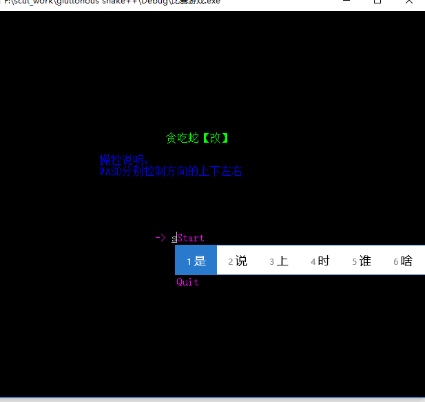
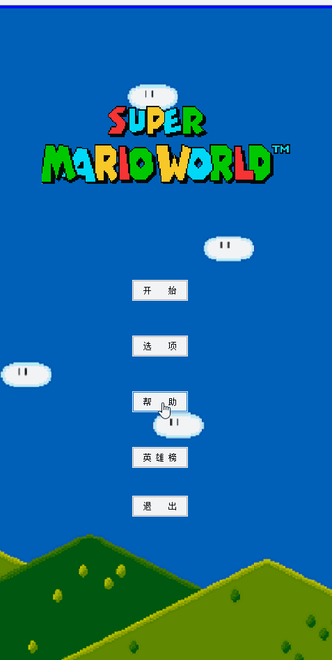

# overview
Github is an important curriculum vitae for a software engineer. Thus I use this repository to record my undergraduate project 
***
## gluttonous snake++
>Environment: vs 2015  + win7  
> Freshman project  

As a rookie, I write all the codes in one file. and I do not use class but struct because of indolence.  In this  game， I learn some basic concepts of Computer Graphics in this project, especially the collision detection.

*Noted that  Chinese annotation is coded in GBK*   

Show： 
  
 ***
 ## qt assignment
 >Environment: QT Creator + QT 5.2.1  + win7  
> Freshman project  

I use QT to rewrite the snake project.  
The project is created in the QT Creator.
You can run the exe version in Win10 if you put the exe into *Qt\5.2.1\msvc2012_64\bin*  
I also upload my working diaries which record my learning process of QT and the design process.  

Show:  
  
 ***